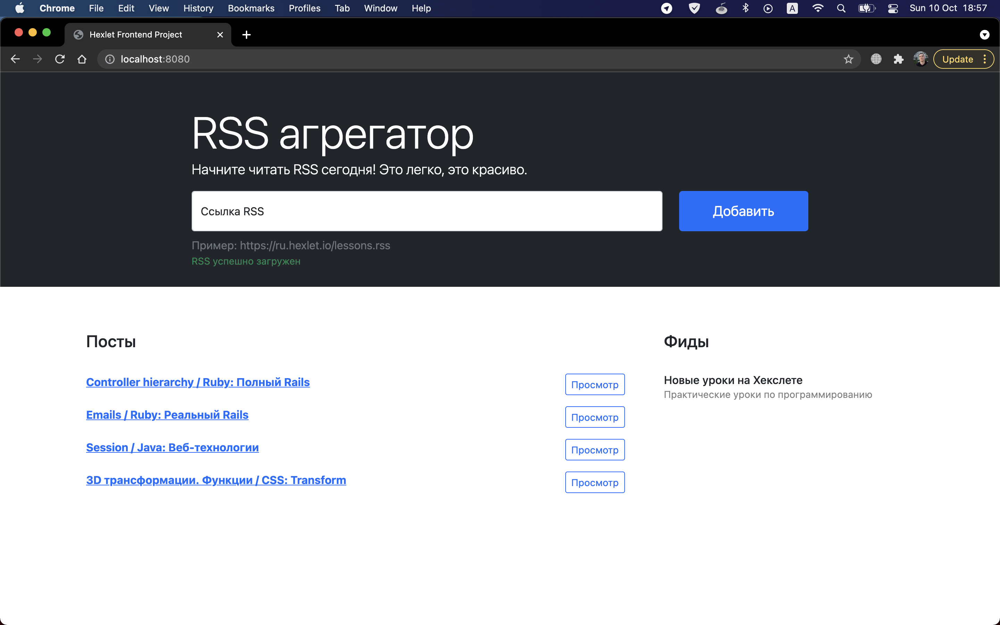

# RSS Aggregator - convenient tool for reading and tracking RSS feeds

## Overview

RSS (RDF Site Summary or Really Simple Syndication) is a web feed that allows users and applications to access updates to websites in a standardized, computer-readable format. Subscribing to RSS feeds can allow a user to keep track of many different websites in a single news aggregator, which constantly monitor sites for new content, removing the need for the user to manually check them.

This web application is a tool for downloading, reading and tracking updates of RSS feeds from different sources. 

## How to use RSS Aggregator

1. Enter the address of the RSS channel in the address bar

2. Click on the submit request button

3. If the request is successfully completed, a list of posts and the name of the RSS feed will appear below

4. Click the button to the right of the post to view the short description of the post. А window with a short description and a link will open

5. Optionally, you can download multiple RSS feeds

Posts will be updated every 5 seconds

### Link: [d5-dimong5.vercel.app](d5-dimong5.vercel.app)
